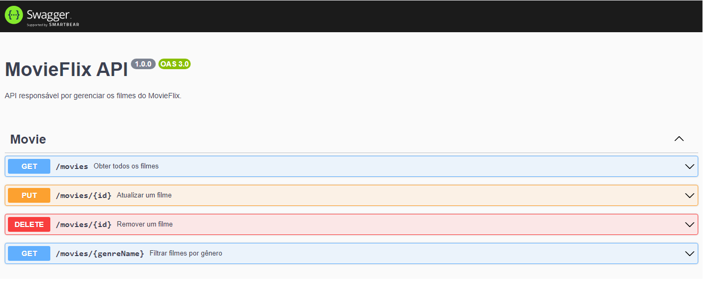

# Projeto MovieFlix API

## Objetivo

- Construir uma API de filmes totalmente do zero utilizando Node, Express, TypeScript e integrar essa API com um banco de dados PostgreSQL;
- Fazer a documentação utilizando o Swagger. 

<br>

## Índice 📜

#### Screenshot

#### Requisitos do Projeto

#### O Projeto

#### Funcionalidades

#### Tecnologias Usadas

#### Como rodar o projeto

<br>

## Screenshot 🎬

<div align='center'>

</div>

<br>

## Requisitos funcionais do Projeto 🧾

- Listar os filmes disponíveis;
- Cadastrar um filme;
- Atualizar dados de um filme;
- Remover um filme;
- Filtrar filmes pelo gênero.

<br>

## O Projeto 📚

Este projeto é um backend construído em NodeJs, TypeScript e Express. Ele se integra a um banco de dados PostgreSQL e as operações com o banco são feitas utilizando a biblioteca Prisma. 

<br>

## Funcionalidades ⚙

- Cadastro de um filme;
- Listagem dos registros do banco;
- Listagem dos registros pelo gênero;
- Atualização dos registros pelo ID;
- Deleção dos registros pelo ID.

<br>

## Tecnologias Usadas 🛠

- NodeJs;
- Express;
- TypeScript;
- ProstgreSQL;
- Prisma;
- Swagger.

<br>

## Como rodar o projeto 🎮

Clone o repositório
```bash
git clone https://github.com/ederhscc/project-movieflix-api
```

 Acesse a pasta do projeto
```bash
cd project-movieflix-api
```

Instalar as dependências
```bash
npm install
```

Execute a aplicação
```bash
npm run dev
```

<br>

## Autor 🧑

### Eder Henrique Santos

<br>

## Links 🔗

Deploy: 

<div align="left">

  <a href = "mailto:ederhscc@gmail.com" target="_blank">
  
  </a>
  </br>
  <a href="https://www.linkedin.com/in/eder-henrique-santos" target="_blank">
  
  </a>
  </br>

</div>